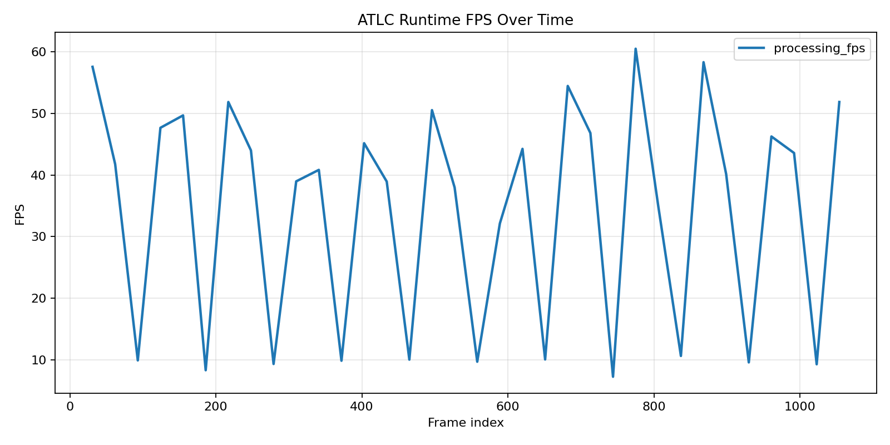
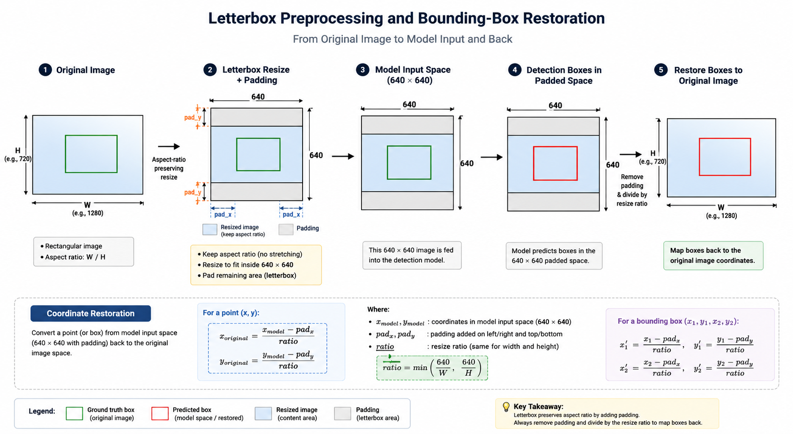
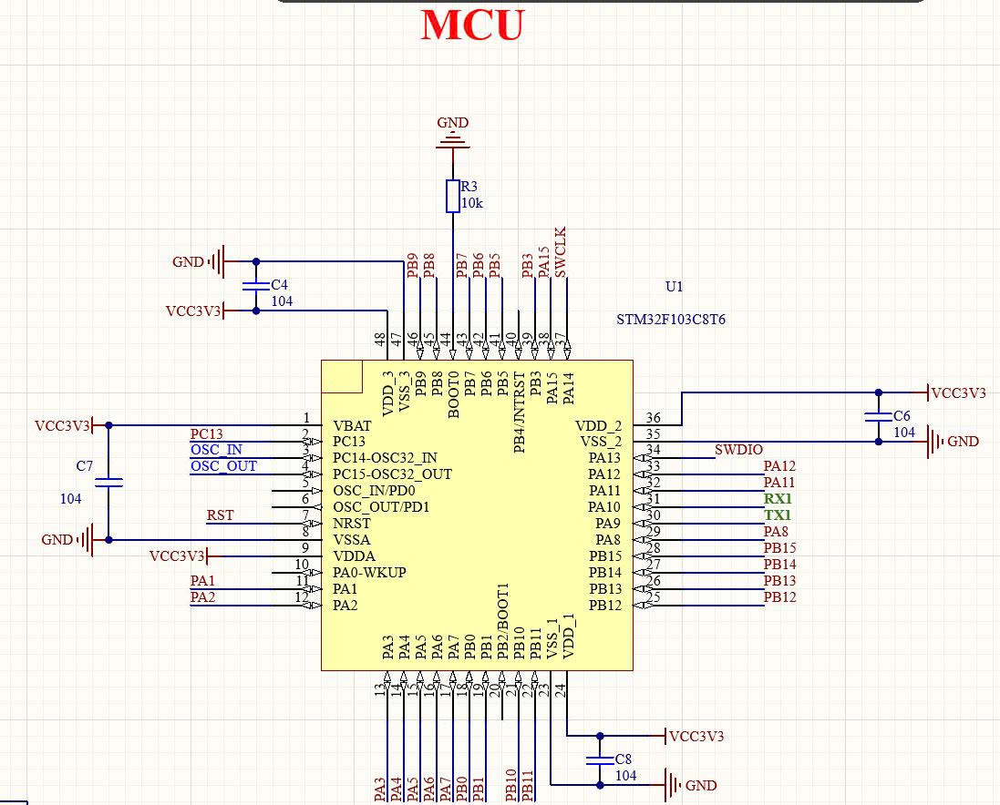
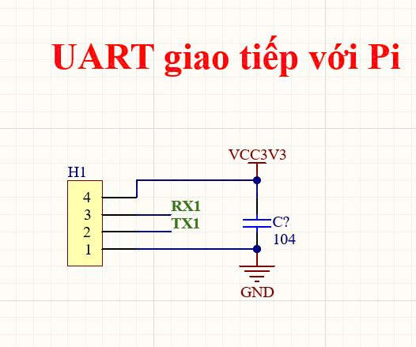
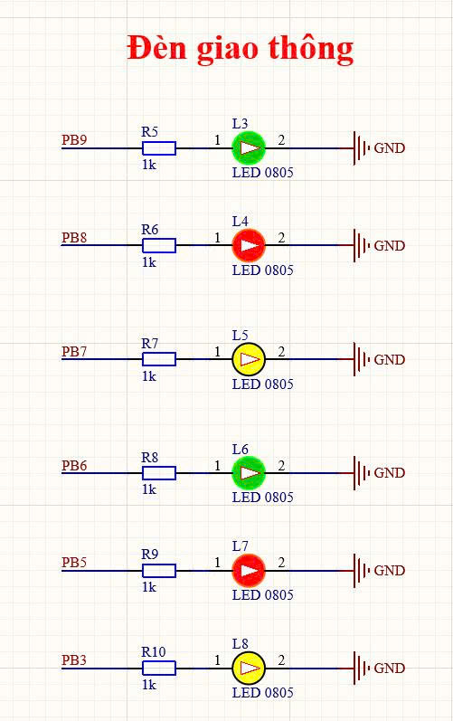

# Adaptive Traffic Light Control System

End-to-end Adaptive Traffic Light Control (ATLC) project combining computer vision, Edge AI deployment, embedded control, UART communication, and hardware integration planning.

This repository is not only an AI notebook. It is structured as a full engineering system:

```text
camera/video input -> YOLO vehicle detection -> traffic logic -> AI-to-MCU protocol -> embedded traffic light controller -> hardware output
```

## Project Overview

The project builds an adaptive traffic light control system using:

- camera-based vehicle detection
- YOLO vehicle classification and bounding boxes
- ROI counting and traffic density estimation
- adaptive green-time planning
- UART communication between an AI host and an MCU controller
- FreeRTOS-based embedded controller execution
- STM32F103C8T6 PCB integration planning

The long-term deployment target is an AI host, such as a Raspberry Pi, connected over UART to a microcontroller-based traffic light controller.

## Why This Project Matters

Traffic-light control is a practical embedded AI problem: perception, timing logic, communication, firmware reliability, and hardware constraints all matter. This project demonstrates that workflow end to end:

- train and validate a vehicle detector
- export the model for deployment
- verify ONNX Runtime inference on image and video inputs
- compare PyTorch and ONNX behavior
- send timing plans to a real-time embedded controller path
- document the transition from ESP32 prototype to STM32 PCB hardware

The project emphasizes traceable engineering decisions, reproducible commands, and honest status tracking.

## System Architecture

```text
Camera / Video
      |
      v
YOLO Vehicle Detection
      |
      v
ROI Counting / Traffic Density
      |
      v
Adaptive Green-Time Planner
      |
      v
UART PLAN Message
      |
      v
ESP32 / STM32 Controller
      |
      v
Traffic Light FSM
      |
      v
LED / PCB Hardware Output
```

Planned hardware split:

```text
Raspberry Pi AI Host
      <-> UART
STM32F103C8T6 Controller PCB
```

## Key Features

- YOLO-based vehicle detection
- custom vehicle detection training workflow
- ONNX export and ONNX Runtime validation
- ONNX Runtime image and video inference
- PyTorch vs ONNX comparison workflow
- letterbox preprocessing correction for deployment consistency
- ROI counting and traffic density pipeline
- adaptive green-time planning
- FreeRTOS-based embedded controller prototype
- UART `PLAN` / `ACK` / `STATUS` protocol path
- traffic light finite-state machine
- ESP32 controller implementation path
- STM32F103C8T6 PCB schematic integration planning
- future Raspberry Pi AI host deployment path

## Current Status

| Area | Status | Notes |
| --- | --- | --- |
| YOLO training | Completed | Custom vehicle detection workflow exists under `yolo_research/` |
| Local AI pipeline | Completed / prototype | Video input, YOLO detection, ROI counting, density estimation, adaptive timing |
| ONNX export | Completed | YOLO `.pt` exported to `deployment/onnx/atlc_yolo26n_custom.onnx` |
| ONNX validation | Completed | ONNX checker and ONNX Runtime session load passed |
| ONNX image inference | Completed | Letterbox preprocessing and box restoration are implemented |
| ONNX video inference | Completed | Basic video smoke test completed with CPUExecutionProvider |
| PyTorch vs ONNX comparison | Completed | Direct-resize deployment bug found and fixed with letterbox preprocessing |
| Quantization | Planned | Phase 16.5, not implemented yet |
| Full benchmark report | Planned | Phase 16.6, not a current performance claim |
| Raspberry Pi AI deployment | Planned | Future AI host path |
| FreeRTOS controller | Completed / prototype | ESP32 FreeRTOS controller path with tasks, queues, UART parser, FSM |
| UART protocol | Completed / prototype | `PLAN`, `ACK` / `NACK`, status reporting, watchdog/fallback concepts |
| STM32 PCB integration | Hardware received / documentation started | Schematic documentation and bring-up planning are being added |
| Final STM32 hardware validation | Planned | Not claimed complete |

## Demo / Visual Results

### Vehicle Detection Result


### Runtime Evidence



### Letterbox Preprocessing Fix

Phase 16.4 found an important deployment bug during the PyTorch vs ONNX comparison:

```text
Bug:
    The first ONNX Runtime path used direct resize preprocessing.

Impact:
    PyTorch / Ultralytics and ONNX Runtime produced different detections.
    Several obvious motorbikes were missed in the ONNX result.

Fix:
    The ONNX path now uses Ultralytics-style letterbox preprocessing.
    Bounding boxes are restored with ratio, pad_x, and pad_y.

Result:
    ONNX detections became visually close to the PyTorch reference path.
```



### STM32 PCB Schematics

Status: schematic documentation and bring-up planning started. Final hardware validation is not claimed complete.







Additional schematic blocks:

- [Power input and 3.3 V regulation](docs/hardware/stm32_pcb/01_power_usb_5v_3v3_regulator.jpg)
- [Dual 7-segment display](docs/hardware/stm32_pcb/05_dual_7segment_display.jpg)
- [Expansion headers](docs/hardware/stm32_pcb/06_expansion_headers.jpg)
- [SWD programming header](docs/hardware/stm32_pcb/07_swd_programming_header.jpg)

## Edge AI Deployment

The trained YOLO model was exported from PyTorch / Ultralytics `.pt` format to ONNX and validated with ONNX Runtime.

Generated model artifacts such as `.pt` and `.onnx` files are intentionally not committed to GitHub. The repository keeps the export, validation, inference, and comparison scripts so the deployment artifacts can be reproduced locally.

Implemented deployment workflows:

- `deployment/onnx/export_onnx.py` - YOLO `.pt` to ONNX export
- `deployment/onnx/validate_onnx.py` - ONNX checker and ONNX Runtime load validation
- `deployment/onnx/infer_onnx_image.py` - ONNX Runtime image inference
- `deployment/onnx/infer_onnx_video.py` - ONNX Runtime video inference
- `deployment/compare/compare_pytorch_onnx_image.py` - PyTorch vs ONNX image comparison

Important engineering finding:

```text
Initial ONNX path:
    Direct resize preprocessing

Observed issue:
    Missed detections compared with PyTorch / Ultralytics

Root cause:
    Ultralytics inference preserves aspect ratio with letterbox preprocessing,
    while the initial ONNX path stretched the image directly to 640 x 640.

Fix:
    Letterbox preprocessing plus letterbox-aware box restoration:

        x1 = (x1 - pad_x) / ratio
        y1 = (y1 - pad_y) / ratio
        x2 = (x2 - pad_x) / ratio
        y2 = (y2 - pad_y) / ratio

Result:
    PyTorch and ONNX visual alignment improved significantly.
```

This is an important deployment lesson: model export alone is not enough. The runtime preprocessing and postprocessing must match the training/reference inference path, otherwise a valid ONNX model can still produce poor real-world detections.

Related docs:

- [Phase 16.1 ONNX export](docs/edge_ai/phase_16_1_onnx_export.md)
- [Phase 16.2 ONNX image inference](docs/edge_ai/phase_16_2_onnx_image_inference.md)
- [Phase 16.3 ONNX video inference](docs/edge_ai/phase_16_3_onnx_video_inference.md)
- [Phase 16.4 PyTorch vs ONNX comparison](docs/edge_ai/phase_16_4_pytorch_vs_onnx_comparison.md)

## Embedded Controller

The embedded controller receives timing commands from the AI host, validates them, executes a traffic light finite-state machine, and reports status/diagnostics.

Implemented or documented controller concepts:

- FreeRTOS tasks
- queues for command ownership
- UART receive task
- validated signal plan queue
- traffic light FSM task
- software timer status reporting
- ACK / NACK protocol
- host timeout watchdog and safe fallback concept
- mutex-protected serial logging
- task notification cleanup

Main embedded prototype:

```text
firmware/esp32_freertos_traffic_light/
```

Relevant docs:

- [FreeRTOS queue warmup](docs/embedded/Phase_15_1_freertos_queue_warmup.md)
- [Traffic FSM task](docs/embedded/phase_15_5_traffic_fsm_task.md)
- [ACK / NACK protocol](docs/embedded/phase_15_6_ack_nack_protocol.md)
- [Host timeout watchdog](docs/embedded/phase_15_9_host_timeout_watchdog.md)
- [Runtime diagnostics](docs/embedded/phase_15_10_runtime_diagnostics.md)

## STM32 PCB Hardware Integration

The project is being extended from software simulation and ESP32/FreeRTOS prototyping toward an STM32F103C8T6-based controller PCB.

Current status:

```text
Hardware received / schematic documentation started / integration planning in progress
```

Schematic blocks under documentation:

- power input and 3.3 V regulation
- STM32F103C8T6 MCU core
- UART interface to Raspberry Pi
- SWD programming header
- traffic light LED outputs
- dual 7-segment display
- expansion headers

Planned STM32 work:

- pin mapping
- firmware bring-up plan
- UART protocol adaptation
- traffic light output verification
- end-to-end Raspberry Pi to STM32 demo

## Repository Structure

```text
.
├── deployment/
│   ├── compare/
│   └── onnx/
├── docs/
│   ├── edge_ai/
│   ├── embedded/
│   ├── hardware/
│   │   └── stm32_pcb/
│   └── security/
├── experiments/
├── firmware/
│   ├── esp32_freertos_traffic_light/
│   └── esp32_traffic_light/
├── pc_app/
│   ├── control/
│   ├── security/
│   └── vision/
├── results/
│   ├── comparison/
│   ├── onnx_image_predictions/
│   └── onnx_video_predictions/
└── yolo_research/
    ├── configs/
    ├── scripts/
    └── src/
```

## Technical Stack

| Area | Tools / Technologies |
| --- | --- |
| Computer vision | OpenCV, Ultralytics YOLO |
| Model training | Python, PyTorch, YOLO training scripts |
| Edge AI deployment | ONNX, ONNX Runtime |
| Comparison / validation | PyTorch vs ONNX image comparison, visual inspection, smoke tests |
| Application logic | ROI counting, density estimation, adaptive green-time planning |
| Embedded firmware | C++, FreeRTOS, PlatformIO |
| MCU path | ESP32 prototype, STM32F103C8T6 controller PCB path |
| Communication | UART, `PLAN` / `ACK` / `STATUS` protocol |
| Target AI host | Raspberry Pi planned |
| Repository workflow | Git, GitHub, phase-based documentation |

## How To Run

Install dependencies:

```bash
python3 -m venv .venv
source .venv/bin/activate
python -m pip install --upgrade pip
python -m pip install -r requirements.txt
```

Inspect available Edge AI commands:

```bash
python deployment/onnx/infer_onnx_image.py --help
python deployment/onnx/infer_onnx_video.py --help
python deployment/compare/compare_pytorch_onnx_image.py --help
```

Example ONNX image inference:

```bash
python deployment/onnx/infer_onnx_image.py \
  --model deployment/onnx/atlc_yolo26n_custom.onnx \
  --image yolo_research/datasets/atlc_2000/images/test/09150440_jpg.rf.DvAoBPo7uxkzXD4hgu8H.jpg \
  --output results/onnx_image_predictions/09150440_onnx.jpg \
  --imgsz 640 \
  --conf 0.25 \
  --providers CPUExecutionProvider
```

Example PyTorch vs ONNX comparison:

```bash
python deployment/compare/compare_pytorch_onnx_image.py \
  --pt-model yolo_research/outputs/runs/atlc_yolo26n_custom/weights/best.pt \
  --onnx-model deployment/onnx/atlc_yolo26n_custom.onnx \
  --image yolo_research/datasets/atlc_2000/images/test/09150440_jpg.rf.DvAoBPo7uxkzXD4hgu8H.jpg \
  --output /tmp/atlc_phase16_4_comparison_fixed.jpg \
  --imgsz 640 \
  --conf 0.25 \
  --providers CPUExecutionProvider \
  --runs 5
```

For the full local adaptive traffic pipeline, see `pc_app/` and the deployment docs under `docs/deployment/`.

## Development Roadmap

| Phase | Status | Description |
| --- | --- | --- |
| Phase 16.5 | Planned | ONNX Quantization Experiment |
| Phase 16.6 | Planned | Edge AI Benchmark Report |
| Phase 16.7 | Planned | Raspberry Pi / TFLite Deployment Path |
| Phase 16.9 | Planned | AI Host `PLAN` Generation Interface |
| Phase 16.10 | Planned | AI-to-MCU Integration Preparation |
| Phase 17.1 | Planned | STM32 PCB Documentation and Pin Mapping |
| Phase 17.2 | Planned | STM32 PCB Bring-Up Firmware |
| Phase 17.x | Planned | End-to-end Raspberry Pi to STM32 hardware demo |

TensorRT / Jetson deployment is optional future work and is not the current target path.

## Engineering Highlights

- End-to-end system boundary from perception to embedded controller behavior
- Deployment-grade model export and ONNX Runtime validation
- Practical PyTorch vs ONNX comparison instead of assuming export correctness
- Real preprocessing bug found and fixed through visual/runtime comparison
- FreeRTOS task ownership, queues, UART parsing, FSM execution, status reporting, and watchdog concepts
- Hardware integration moving toward an STM32F103C8T6 PCB with documented schematic blocks
- Phase-based documentation for reproducibility and recruiter review
